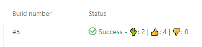
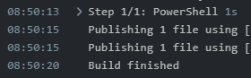
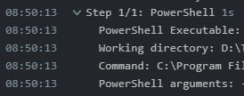
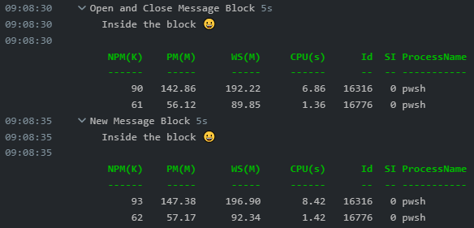

# TeamCityLog

A module for fully utilising TeamCity build logging from Powershell.

Uses TeamCity's build-log [service-messages](https://www.jetbrains.com/help/teamcity/service-messages.html).


## Getting Started

```powershell
Import-Module 'TeamCityLog'
Write-TeamCityBuildMessage 'Hello, World!'
```

## Why use Service Messages?

The TeamCity log, without Service-Messages, does not parse special characters and does not display non-ascii characters.

For instance, if I want to output the below to the log:

```powershell
Write-Host "Hello, 🌵!"
```

This is what I'll get:

```
Hello, ??!
```

However - using a service message, the characters of the message are escaped in such a way as to tell TeamCity to render them. Thus:

```powershell
Write-TeamCityBuildMessage "Hello, 🌵!"
```

Shows the below in the log:

```
Hello, 🌵!
```

This is the same with new line characters (`\n`, `\r`). Each new line is treated as a single log message instead of part of the same log line.

Consider the below:

```powershell
$MyObject = [PSCustomObject]@{
	Name           = 'Mr Spock'
    Species        = 'Vulcan'
    Age            = 161
    FavouriteEmoji = "🖖"
}

Write-Host "$($MyObject | Format-List | Out-String)"

Write-TeamCityBuildMessage "$($MyObject | Format-List | Out-String)"
```

`Write-Host` spits out 6-7 lines, each a different log entry, read by teamcity at a unique time.

```powershell
08:50:13   
08:50:13   Name           : Mr Spock
08:50:13   Species        : Vulcan
08:50:13   Age            : 161
08:50:13   FavouriteEmoji : ??
08:50:13   
08:50:13   
```

Whereas using a Service Message, we get a single log-line:

```powershell
08:50:13   
           Name           : Mr Spock
           Species        : Vulcan
           Age            : 161
           FavouriteEmoji : 🖖

```

Service Messages also allow the build runner (powershell) to interact with the build agent (TeamCity). They can, among other things: report build problems, build statistics, build parameters, etc. 

They can also cancel the build and set the build status.

```powershell
Write-TeamCityBuildStatus "🌵: 2 | 👍: 4 | 👎: 0"
```



The best feature of Service Messages, in my opinion, is message blocks. You can see these in use in the build log already:

The `Step 1/1: PowerShell` block here is folded:



and unfolded:



You can do this with your own logging to logically group log items. As an added bonus, TeamCity will show you the elapsed time from opening to closing a message block.

This module exposes 2 ways to use message blocks.

1. Explicitly calling `Open-TeamCityBuildMessageBlock` and `Close-TeamCityBuildMessageBlock`

    > If calling `Open-` and then `Close-` the same message must be passed to each.

    ```powershell
    Open-TeamCityBuildMessageBlock 'Open and Close Message Block'
    Write-TeamcityBuildMessage "Inside the block 😀"
    $Procs = Get-Process powershell | Select -first 2
    Write-TeamCityBuildMessage "$($Procs | Format-Table | Out-String)"
    Start-Sleep -Seconds 5
    Close-TeamCityBuildMessageBlock 'Open and Close Message Block'
    ```

2. Calling `New-TeamCityBuildMessageBlock` and passing a script block.

    ```powershell
    New-TeamCityBuildMessageBlock 'New Message Block' {
        Write-TeamcityBuildMessage "Inside the block 😀"
        $Procs = Get-Process pwsh | Select -first 2
        Write-TeamCityBuildMessage "$($Procs | Format-Table | Out-String)"
        Start-Sleep -Seconds 5
    }
    ```

    > The script block passed in to `New-TeamCityBuildMessageBlock` is executed in the current scope. Not new scope is created. *e.g. Variables declared/set within the script block are accessible outside of it also.*



## Command Prefixes

This module supports command prefixes. By default all commands are prefixed with
`TeamCity`, but you can specify something else (or nothing) by using the 
`-Prefix` parameter of `Import-Module`.

```powershell
# With default 'TeamCity' prefix
Import-Module 'TeamCityLog'

# With custom 'TC' prefix
Import-Module 'TeamCityLog' -Prefix 'TC'
```
